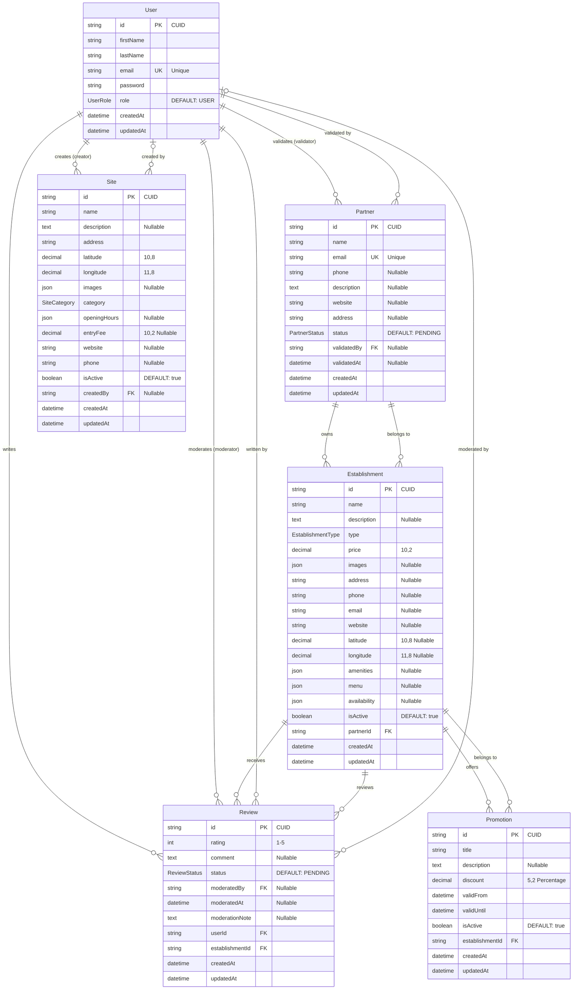

# Diagramme ERD - Base de données Touris

## Vue d'ensemble de la base de données

Ce diagramme ERD représente la structure complète de la base de données de l'application Touris, générée à partir du schéma Prisma.

## Énumérations (Enums)

### UserRole
- `USER` : Utilisateur standard
- `ADMIN` : Administrateur système
- `PARTNER` : Partenaire commercial

### EstablishmentType
- `HOTEL` : Hôtel
- `RESTAURANT` : Restaurant
- `BAR` : Bar
- `CAFE` : Café
- `ATTRACTION` : Attraction touristique
- `SHOP` : Boutique
- `SERVICE` : Service

### PartnerStatus
- `PENDING` : En attente de validation
- `APPROVED` : Approuvé
- `REJECTED` : Rejeté
- `SUSPENDED` : Suspendu

### ReviewStatus
- `PENDING` : En attente de modération
- `APPROVED` : Approuvé
- `REJECTED` : Rejeté

### SiteCategory
- `MONUMENT` : Monument
- `MUSEUM` : Musée
- `PARK` : Parc
- `BEACH` : Plage
- `MOUNTAIN` : Montagne
- `CULTURAL` : Site culturel
- `RELIGIOUS` : Site religieux
- `NATURAL` : Site naturel
- `HISTORICAL` : Site historique
- `ENTERTAINMENT` : Divertissement

## Description des relations

1. **User ↔ Partner** : Un utilisateur admin peut valider plusieurs partenaires
2. **User ↔ Review** : Un utilisateur peut écrire plusieurs avis et un admin peut modérer plusieurs avis
3. **User ↔ Site** : Un utilisateur admin peut créer plusieurs sites touristiques
4. **Partner ↔ Establishment** : Un partenaire peut gérer plusieurs établissements
5. **Establishment ↔ Review** : Un établissement peut recevoir plusieurs avis
6. **Establishment ↔ Promotion** : Un établissement peut proposer plusieurs promotions

## Contraintes importantes

- **Cascade Delete** : La suppression d'un partenaire supprime tous ses établissements
- **Cascade Delete** : La suppression d'un établissement supprime tous ses avis et promotions
- **Cascade Delete** : La suppression d'un utilisateur supprime tous ses avis
- **Unicité** : Email unique pour User et Partner
- **Validation** : Les notes (rating) sont limitées entre 1 et 5
- **Géolocalisation** : Latitude/longitude avec précision décimale appropriée

## Types de données spéciaux

- **JSON** : Utilisé pour stocker des tableaux (images, amenities, menu, etc.)
- **DECIMAL** : Utilisé pour les prix et coordonnées géographiques
- **TEXT** : Utilisé pour les descriptions et commentaires longs
- **CUID** : Identifiants uniques cryptographiquement sécurisés